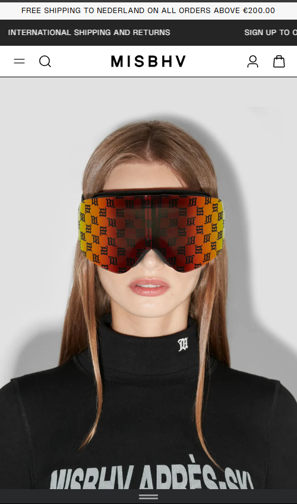
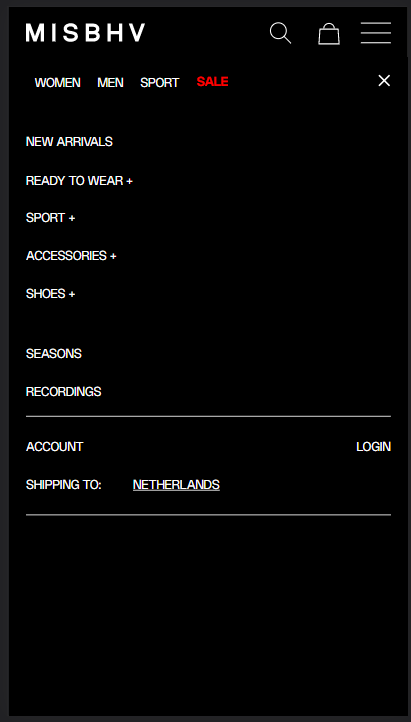
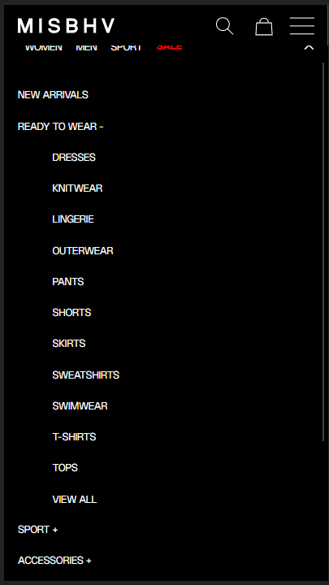
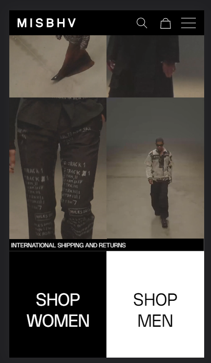
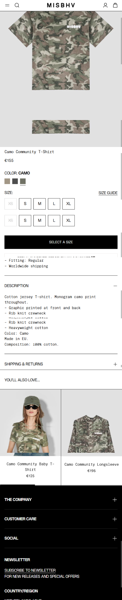
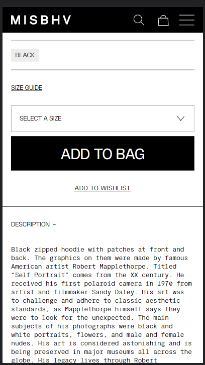
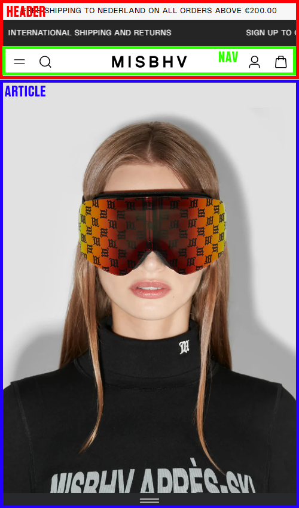
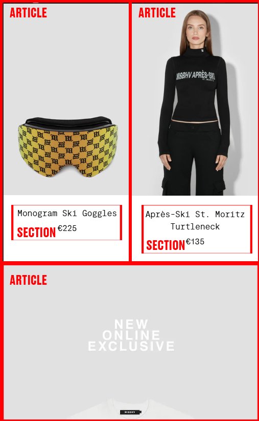

# Procesverslag
Markdown is een simpele manier om HTML te schrijven.  
Markdown cheat cheet: [Hulp bij het schrijven van Markdown](https://github.com/adam-p/markdown-here/wiki/Markdown-Cheatsheet).

Nb. De standaardstructuur en de spartaanse opmaak van de README.md zijn helemaal prima. Het gaat om de inhoud van je procesverslag. Besteedt de tijd voor pracht en praal aan je website.

Nb. Door *open* toe te voegen aan een *details* element kun je deze standaard open zetten. Fijn om dat steeds voor de relevante stuk(ken) te doen.

## Jij

  
uitwerken voor kick-off werkgroep

  ### Auteur:
Jeffrey Netten
  
  #### Je startniveau:
  blauw

  #### Je focus:
  Surface plane
 

## Je website

  
uitwerken voor kick-off werkgroep

  ### Je opdracht:
  https://misbhv.com/eu/en/

  #### Screenshot(s) van de eerste pagina (small screen): 
  
  
  
  
  

  #### Screenshot(s) van de tweede pagina (small screen):
    
  
  

## Intakeopdracht/Typografie (week 1)

  
Intakeopdracht en video's over codering

  ### De video's
  Vanwege dat ik dit vak al 2 keer heb herkanst ondertussen had ik de video's eigenlijk al gezien.
  Maar ik heb ze opnieuw gekeken om mezelf weer terug in het vak te krijgen.
  Ik was zelf niet bij de werkgroepen aanwezig I.V.M mijn stage die ik op dit moment volg. Daarom heb ik dit in mijn eigen tijd gedaan.

## Toegankelijkheid (week 2)

 
Video's over toegankelijkheid
 

  ### De video's
  Deze week bestond net als vorige week uit het bekijken van informatieve video's over coderen. Zo heb ik alle video's die op DLO staan weer gekeken.
  Ik was zelf weer niet bij de werkgroepen I.V.M. de stage die ik op dit moment volg.

  ### Beoordelingsformulier
  Na mijn fouten van vorig jaar tijdens dit vak leek het mij handig het beoordelingsformulier nog eens goed doorheen te gaan zodat ik niet weer dezelfde fouten zou maken.
  Dit heb ik daarom grondig gedaan voordat ik met mijn website aan de slag zal gaan.

## Breakdownschets (week 3)

  
Breakdown schetsen van je website

  ### de hele pagina: 
  Hieronder is de breakdownschets te vinden van mijn gehele pagina.
  

  ### dynamisch deel (productpagina): 
  Hieronder is de breakdownschets te vinden van mijn gehele productpagina.
  

## Werken aan website (week 4)

  
Deze week ben ik gaan werken aan de opzet van mijn website.

  ### MISBHV FOTOS
  Ik begon met alle afbeeldingen van de website bij elkaar te halen. Dit heb ik gedaan via een image extractor website.
  Daar kwam ik wel tegen het probleem aan dat elementen als de vergrootglas bij het zoeken en het winkelmandje niet extractable zijn.
  Om deze reden heb ik deze zelf van het internet afgehaald en heb ik daarvoor dus vervangende elementen gebruikt.

  ### HEADER
  Nadat ik de foto's bij elkaar had begon ik met het bouwen van de website.Ik besloot als eerste alleen de HTML/CSS op te bouwen en later pas JAVASCRIPT toe te voegen.
  Zo besloot ik om te beginnen met de header op te bouwen.
  Dit deed ik door het logo toe te voegen aan de header en dit te centeren. Ook voegde ik de navigatie toe aan de header.
  Onder het nav elementen plaatste ik een unordered list. Deze bestaat uit png's van: Een vergrootglas, Een Winkelmandje en De Hamburger menu.

  Om de afbeeldingen te krijgen zoals ze staan op de MISBHV website gebruikte ik Display:Flex. Dit zorgde ervoor dat het logo en de navigatie naast elkaar kwamen te staan.
  Toch waren er nog wat schoonheids foutjes bij de pagina. Zo vulde de achtergrond niet de hele ruimte en was er veel witruimte. Hiervoor zette ik de padding en margin op 0.
  Dit zorgde ervoor dat nu het hele scherm is opgevuld. Dit zorgde er alleen voor dat de header te breed was vergeleken de website van MISBHV. Daarom voegde ik als laatste nog een border-box toe.
  Dit maakte de header net was kleiner waardoor het nu het meest overheen kwam met de pagina van MISBHV.

  ### VIDEO
  Tijdens het maken van deze opdracht had MISBHV heel groot een video op de voorpagina. Ik wilde dit namaken dus besloot te kijken waar de video naar doorgelinked was.
  Na een beetje research had ik al snel de video gevonden en besloot ik de video toe te voegen aan de HTML. Dit deed ik door middel van een iframe die linked naar de youtube video.
  Dit plaastste ik daarbij in een divje om het af te scheiden van de rest van de pagina.
  

  ### PRODUCTEN
  De rest van de MISBHV pagina bestaat vooral uit productfoto's die doorlinken naar het product. Deze staan soms op de hele pagina maar ook soms naast elkaar.
  Ze veranderen dit per product voor variatie. Ik besloot daarom het eerste product neer te plaatsen over de gehele ruimte van de pagina. 
  Dit deed ik doormiddel van het product een class te geven genaamd: .front en daarbij de max width op 100% te zetten van de pagina.
  Ook wilde ik dat dit het product is dat de gebruiker naar de volgende pagina brengt.
  Zo staat het product nu in een a href die doorlinked naar de volgende pagina als je erop klikt.

  ### TEKST
  Op de pagina van MISBHV staat een bewegende tekst over Gratis Returns en internationale verzending. Deze tekst beweegt op de pagina en wil ik uiteindelijk ook beweegbaar hebben.
  Op dit moment heb ik nog geen idee hoe ik dat zou moeten doen. Dus voor nu laat ik het gewoon als een balk met daarop de tekst.
  Dit doe ik door middel van een section toe te voegen genaamd: shipping en daarin een p te zetten. 
  Daarvan waren de letters meteen wit en de achtergrond zwart zoals ik had aangegeven in de root van de pagina.
  Om de tekst in het midden te krijgen voegde ik een top van 50% toe en een left van 50%.

  ### MEN/WOMEN
  Het volgende stuk van de pagina bestaat uit 2 gedeeltes naast elkaar genaamd: 'shop men' en 'shop women'
  Deze 2 gedeeltes heb ik onder een section gezet en in een 2 divjes omdat deze 2 gedeeltes wel bij elkaar horen maar afgezonderd zijn van elkaar.
  Shop men gaf ik daarbij een zwarte achtergrond en shop women een witte achtergrond.
  Ook deed ik de tekst align centered zodat de text in het midden van de pagina zou eindigen en gaf ik de box een padding van 15%.
  Dit was een kwestie van vele procenten testen tot ik op het juiste formaat kwam. Dit heb ik uiteindelijk ook herhaald voor 'shop women'.
  Om beide gedeeltes naast elkaar te krijgen gebruikte ik disply: block.

  ### ALL PRODUCTS
  Ik heb een gedeelte toegevoegd genaamd all products. Dit spreekt voor zich en was eigenlijk hetzelfde principe als PRODUCTEN hierboven.
  Ik gaf het een Width van 100% zodat het volledige breedte nam over de pagina.
  Voor de rest was hier weinig aan toe te voegen.

  ### SUBSCRIBE
  Om de pagina van MISBHV perfect na te maken heb ik ook het subscribe gedeelte overgenomen.
  Dit deed ik door een div toe te voegen aan de pagina met de class: sub.
  Ik voegde als eerste de tekst toe die op de pagina stond van MISBHV.
  Deze tekst wilde ik daarna onder elkaar hebben de daarvoor gebruikte ik BR in de html tekst.

  Om de tekst de juiste opmaak te geven moest ik even wat research doen.
  Het centeren en de font size vinden was het makkelijkere gedeelte.
  De font size was een kwestie van steeds iets anders proberen tot het werkt.
  Het probleem waar ik nu tegenaan kwam was dat er geen ruimte om de letters was.
  Zo besloot ik padding toe te voegen en hierbij de procenten aan te passen tot ik het gewenste resultaat vond.
  uiteindelijk eindigde ik met 10%.

  Daarna moest ik het internet even afzoeken om een border lijn toe te voegen.
  Na wat research te hebben gedaan vond ik daarbij hoe het moest. Zo bracht ik een border en outline aan deze class en nu heeft dit gedeelte een zwarte border zoals op de officiele website.

  ### PRODUCTEN MET PRIJS EN NAAM
  Dit gedeelte van de website is eigenlijk een combinatie van alles secties hierboven.
  Omdat ik dit nu allemaal al een keer had gedaan was dit een goede test voor mij.

  Zo besloot ik om binnen een section weer 2 divs te plaastsen.
  Om deze divs naast elkaar te krijgen gebruikte ik display flex en daarbij flex direction row. Zo kwamen beide divs perfect naast elkaar.
  
  Hierbij gaf ik beide divs hun eigen classes.
  Onder elke sectie besloot ik de afbeelding te zetten met de benodigde tekst.
  Daarna ging ik door naar de CSS. Binnen de CSS gebruikte ik text align center om alle tekst in het midden te krijgen.

  De afbeeldingen waren compleet buiten proporties. Maar het probleem was dat als ik de volledige class zou aanpassen ik ook elementen zou aanspreken die ik niet zou willen aanspreken.
  Daarom besloot ik om de images ook nog in aparte classes te zetten.
  Deze image classes moest ik daarna zo krijgen dat de afbeeldingen de juiste grootte zouden worden.
  Dit deed ik door als eerste de width op 100% te zetten. Dit zorgde ervoor dat de afbeelding over het hele vak in de breedte zal zijn.
  Daarna moest ik nog de ruimte om de afbeelding heen veranderen omdat de tekst er tegen aan zat. Dit wilde ik dus alleen aan de onderkant
  Daarom gaf ik alleen de margin aan de onderkant via margin bottom 10%.
  
  
  Daarnaast maakte ik net als bij SUBSCRIBE een border aan en daarbij een outline.
  Dit deed ik zodat SUBSCRIBE en PRODUCTEN samen dezelfde grenslijn lijken te hebben zoals op de officiele pagina.
  
  Daarna om de tekst op de juiste plek te krijgen gebruikte ik weer BR in html.
  Dit deed ik hetzelfde bij de andere class. Dit zorgde ervoor dat beide gedeeltes evenredig waren aan elkaar.
  Beide elementen staan daarbij ook op display block. Dit zorgde ervoor dat beide elementen naast elkaar kwamen te staan.

  

  ### FOOTER
  Als laatste gedeelte moest ik de footer regelen.
  Om de footer in de juiste ruimtes te krijgen besloot ik om de footer te verspreiden over verschillende elemeten.
  Zo heb ik een aantal sections toegevoegd om onderscheid te maken tussen de verschillende gedeeltes van de footer.

  Het bovenste gedeelte van de footer bestaat uit een simpele tekst.
  Deze tekst is er alleen om mensen aan te sporen voor de form die ik eronder heb gezet.
  Deze form heb ik toegevoegd door een form te gebruiken met input type text en als placeholder text: email adress

  Op de officiele website is alles afgescheiden door middel van lijnen binnen de footer.
  Dit heb ik ook gedaan door hr elementen toe te voegen aan de html.
  
  Onder de streep heb ik een unordered list neergezet met daarin alle informatie per list element.

  Daarna voor de laatste 2 gedeeltes gebruikte ik net als hierboven een HR element om de gedeeltes af te scheiden en daarbij ook unordered lists om de teksten af te scheiden van elkaar.

  Het enigste probleem dat ik nu nog had was de vormgeving van de footer en dat werk nog best ingewikkeld.

  ### FOOTER VORMGEVING
  Het eerst waar ik mee begon was kijken naar de gehele footer. Zo vulde de gehele footer niet het hele gedeelte dat ik wilde dat het vulde.
  Zo voeg ik een border toe aan de footer om daarbij de het gat op te vullen met zwart.

  Daarna ging ik door naar de eerste sectie van de footer dit was de SIGN UP tekst. Om dit juist te krijgen ging ik spelen met de margins van de van de tekst
  Uiteindelijk kwam ik uit op een 5 procent left margin en een 10 procent margin top.
  Dit zorgde ervoor dat de tekst mooi aan de linker kant terecht kwam.

  Daarna was het tijd voor de form vormgeving te brengen. Dit was een kwestie van alleen de margin aan de linkerkant aan te passen.

  Nu kwam ik bij een ingewikkelder gedeelte. Met wat research online kwam ik er gelukkig wel uit.
  Als eerste begon ik met de vormgeving met de gehele list. Zo gaf ik de list een margin left om een betere plaatsing op de site te krijgen.
  Daarnaast bracht ik een list style non toe om de stipjes weg te krijgen. En om alles aligned aan de linker kant te krijgen gebruikte ik text align left.
  
  Ik moest namelijk de volledige list gaan vormgeven op een werkende manier zodat het goed bij de officiele pagina zou passen.
  Dit deed ik door middel van de unordered list een display block te geven. Daarna ging ik verschillende margins aanpassen om de juiste margins om alle elementen te krijgen.
  Ook moest ik een padding toevoegen om tussen de elementen te plaasten. Uiteindelijk bracht ik ook aan de verschillende elementen binnen de list verschillende paddings om het juiste resultaat te krijgen.

  Nu voor de andere 2 lists gebruikte ik dezelfde techniek maar gaf ze wel hun eigen aparte classes.
  Zo gebruikte ik in beide gevallen weer text align left om alles naar links te krijgen.
  Bij deze lists moeten de elementen naast elkaar en daarbij gebruikte ik Display inline block.
  Daarna was het eigenlijk net als hierboven vooral een kwestie van vele verschillende margins en paddings toevoegen aan de elementen om het juiste resultaat te krijgen.

  Het enigste probleem die ik nu nog had was dat de HR gedeeltes niet helemaal hetzelfde waren als op de webiste.
  Om dit op te lossen ging ik online kijken of dit mogelijk was. Daar kwam ik erachter dat je verschillende CSS methodes kan gebruiken op een HR elementen om het juist te krijgen.
  Zo voegde ik verschillende margins toe aan de lijnen om meer ruimte te krijgen tussen de tekst en lijnen.
  Als laatste wilde ik de lijnen zo krijgen dat ze niet helemaal tegen de grens van de pagina aan zouden komen. 
  Daarom besloot ik een width neer te zetten van 90% en een margin left van 5%. Dit zorgde ervoor dat er nu aan beide kanten evenveel ruimte tussen de lijnen zat en het mooi centered is.

  

  

  

  
  
  

  

## JAVA SCRIPT (week 5)

  
JAVA SCRIPT toegevoegd aan elementen op de website en de 2e pagina gemaakt!

 

  ### 2e pagina
  Als eerste wat ik deze week heb gedaan is het beginnen aan de 2e pagina. Dit had ik al best snel gedaan door middel van elementen te pakken uit de hoofdpagina.
  Zo ben ik begonnen met de header en footer compleet te kopieren en mee te nemen naar deze pagina.
  Na dat gedaan te hebben plaastste ik de productfoto bovenaan de pagina door meteen een width van 100% toe te voegen zodat het de gehele pagina indeling inneemt.

  Daarna was het een kweste van de losse tekst elementen van de productpagina goed op een rij te krijgen.
  Hiervoor plaastste ik de elementen in een unordered list. Dit verdeelde ik in 3 gedeeltes. Ik gebruikte hiervoor dezelfde techniek als die ik gebruikte bij de footer.
  Zo gaf ik de elementen binnen de list hun eigen class om daarbij hun padding te bepalen en gaf ik de list in zijn geheel verschillende margins om op het juiste resultaat te komen.
  Daarnaast haalde ik de stipjes weg door middel van list style non. De font mocht toen nog wel wat kleiner en daarvoor gebruikte ik: font-size small.

  Onder dit gedeelte moest een lijn net als in de footer. Ik besloot hier daarom om weer een HR te plaasten met precies dezelfde instellingen als in de footer.
  Daarna is er een sectie met de size guide en size keuze. Hiervoor deed ik online research naar hoe je een drop down menu maakt. Dit was niet zo heel ingewikkeld en was uiteindelijk gewoon een kwest van:
  Een section maken daarbij deze section een class te geven. Die class gebruik je uiteindelijk voor de margins zodat de drop down menu op de juiste plek staat.
  Dan uiteindelijk kan je een select id aanmaken in de html en vanuit dat kan je verschillende options neerzetten. In mijn geval waren dat de maten van de kleding.

 Het probleem de de dropdown menu is dat ik Javascript hiervoor wil gebruiken. Later in dit verslag vertel ik daar meer over. Hier zal ik nu alleen over de CSS praten. Om de dropdown menu uiteindelijk in de juiste formaat te krijgen gebruikte ik width 90%. Dit maakte de menu net zo breed als de HR die erboven stond.
  Daarnaast heb ik ook de hoogte en grootte van de font aangepast en ben ik gaan spelen met de margins voor het juiste resultaat.

  Daarna heb ik nog een los element toegevoegd met de tekst add to wishlist maar dat hield niet zoveel in.

  Alle elementen die hieronder zijn neergezet waren eigenlijk vooral een kwestie van dingen van de vorige pagina overnemen en dan net de inhoud aanpassen.
  Zoals een border toevoegen aan verschillende box elementen. Tekst links alignen zoals bij de footer hetzelfde als bij de description en elementen centeren binnen met flex box gerangschikte boxes.
  Over het algemeen was dit dus allemaal een kwestie van herhalend werken.

  ### JAVA SCRIPT
  Qua java script gebruik ik in het document maar 2 elementen.
  Dit heb ik namelijk gedaan in een darkmode toe te voegen aan de website. 
  MISBHV heeft dit namelijk zelf niet en dit leek mij een sterke toevoeging.
  Ik heb daarom een darkmode icon toegevoegd aan de navigatie bar. In JAVA script heb ik daarbij de code toegevoegd die gelinked is met de class icon. Als je daar nu op klikt dan toggled die knop de darkmode op de website. De darkmode variabelen zijn in dit geval de kleuren die op de website omdraaien. Zo word wit, zwart en zwart, wit.

  Ook heb ik via JAVASCRIPT een dropdown menu toegevoegd aan het bestand op de productpagina. Dit menu spreekt vrijwel voor zich, het is een dropdown menu waarbij je de maten kan veranderen en die maten moeten dan ook blijven staan. 
  

### HAMBURGER MENU

  
Het hamburger menu uitwerken op de website.

Voor het hamburger menu op de website gebruik ik nu volledig html en CSS. Ik heb er expres voor gekozen om het hamburger menu anders te doen dan op de officiele website. Dit heb ik gedaan omdat het hamburger menu op de officiele website heel veel informatie toont. Dit is voor de gebruiker onhandig en kan veel overzichtelijker en makkelijk klikbaarder weergegeven worden. Hiervoor heb ik gekozen om het hamburger menu subtiel en praktisch te houden. Zo toont het hamburger menu nu maar 7 opties in plaats van 19 opties. Als je wel naar deze andere opties zou willen gaan kan je doorklikken naar een andere pagina met daarbij meer filter opties.

Het hamburger menu heb ik ook wat beter opgemaakt door middel van het font kleiner te maken en padding toe te voegen. Daarnaast werkt het hamburger menu ook met de darkmode die ik eerder heb toegevoegd via javascript.

### SR ONLY

  
SCREEN READER FRIENDLY AANPASSINGEN

Na het gesprek met de docent vorige week heb ik te horen gekregen dat ik screen reader only classes moet toevoegen aan de website.
Dit heb ik nu gedaan na de bron te hebben gevonden genaamd Inclusively Hidden CSS Tricks.
Mijn pagina is dus nu ook goed te lezen voor mensen die een screenreader gebruiken.

## Bronnenlijst

  
continu bijhouden terwijl je werkt

  Nb. Wees specifiek ('css-tricks' als bron is bijv. niet specifiek genoeg).

  1. De powerpoint presentaties
  2. https://www.youtube.com/watch?v=9LZGB3OLXNQ&t=539s&ab_channel=EasyTutorials (Light to Dark mode)
  3. https://www.youtube.com/watch?v=1iS0r238G4g&t=517s&ab_channel=DeltatyCode (Hamburger menu)
  4. https://www.youtube.com/watch?v=BsaubFxvGN8&t=289s&ab_channel=TheWheelchairGuy (Displaying of elements)
  5. https://www.youtube.com/watch?v=lsP5agWYjCU&t=252s&ab_channel=TheWheelchairGuy (Content plaatsing)
  6. https://www.youtube.com/watch?v=2O8pkybH6po&t=130s&ab_channel=BroCode (Forms)
  7. https://www.youtube.com/watch?v=OOy764mDtiA&ab_channel=DaniKrossing (Video in website plaatsen)
  8. https://www.youtube.com/watch?v=kmVrFwkI9Fw&t=138s&ab_channel=MohitSarangal (Image Sizing)
  9. https://www.youtube.com/watch?v=jx5jmI0UlXU&t=238s&ab_channel=WebDevSimplified (CSS image/element placing)
  10. https://www.youtube.com/watch?v=yCyD5AZegLk&ab_channel=CreativeRafikul (Tekst van rechts naar Links)
  11. https://css-tricks.com/inclusively-hidden/ (Screen Reader)
  12. https://www.youtube.com/watch?v=eKo1NV1qxbc&ab_channel=HowToCodeSchool (dropdown menu)
  13. https://www.youtube.com/watch?v=hBbrGFCszU4&ab_channel=QuickCodingTuts (dropdown menu)

